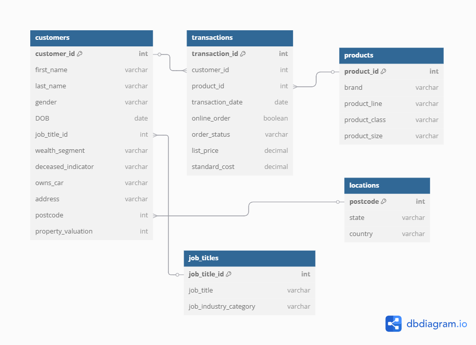

### Структура базы данных

### **Нормализация базы данных (1НФ → 3НФ)**  

В исходных данных было несколько проблем:  
- В таблице **`customers`** информация о работе (`job_title`, `job_industry_category`) повторялась у многих клиентов.  
- В **`transactions`** хранились полные данные о товарах (`brand`, `product_line` и т. д.), хотя логичнее было вынести их в отдельную таблицу.  
- В **`customers`** штаты и страны были связаны с каждым клиентом, хотя правильнее привязывать их к почтовому индексу (`postcode`).  

#### **Что я сделал?**  
✅ **1НФ:** убрал повторяющиеся группы данных, каждая колонка теперь содержит только одно значение.  
✅ **2НФ:** вынес данные, которые не зависят от первичного ключа, в отдельные таблицы (`products`, `job_titles`, `locations`).  
✅ **3НФ:** устранил зависимость одних неключевых полей от других (например, теперь `state` и `country` зависят только от `postcode`).  

#### **Как теперь устроена база?**  
- `customers` теперь хранит только данные клиентов, а не их работу и местоположение.  
- `transactions` содержит только ID товаров, а не их характеристики.  
- `products` теперь справочник товаров, без дублирования.  
- `locations` привязывает `postcode` к `state` и `country`.  
- `job_titles` теперь хранит профессии отдельно, без повторов.  